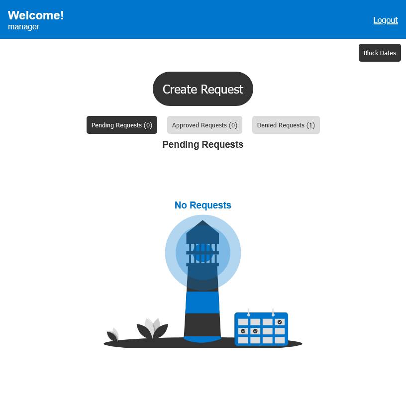
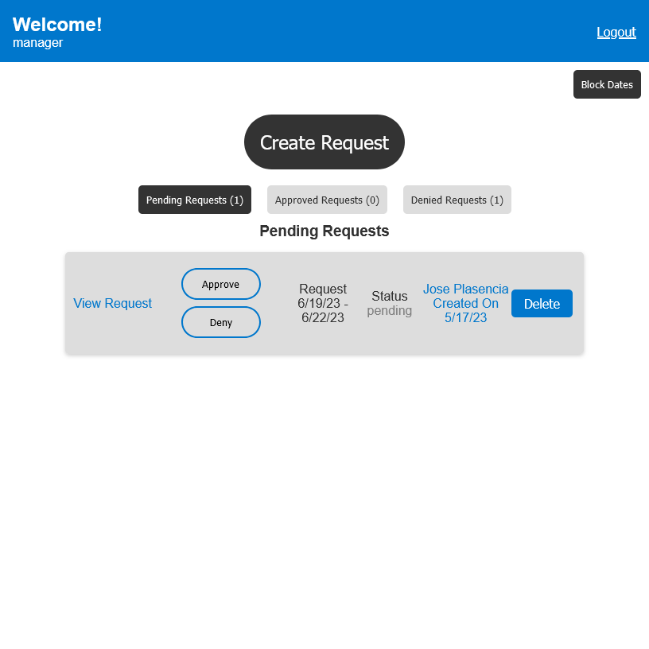
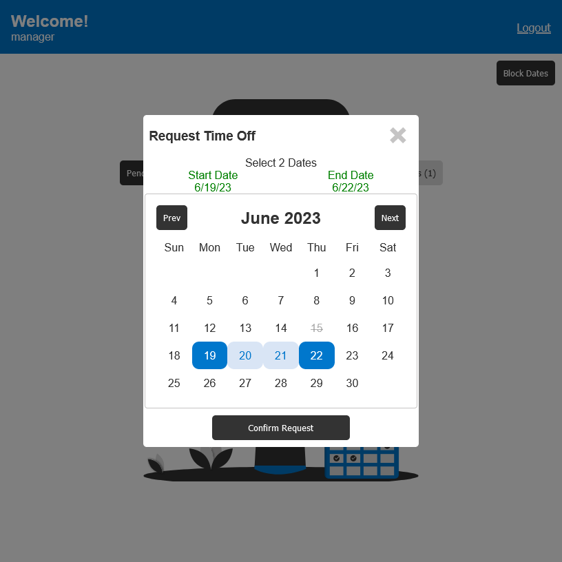
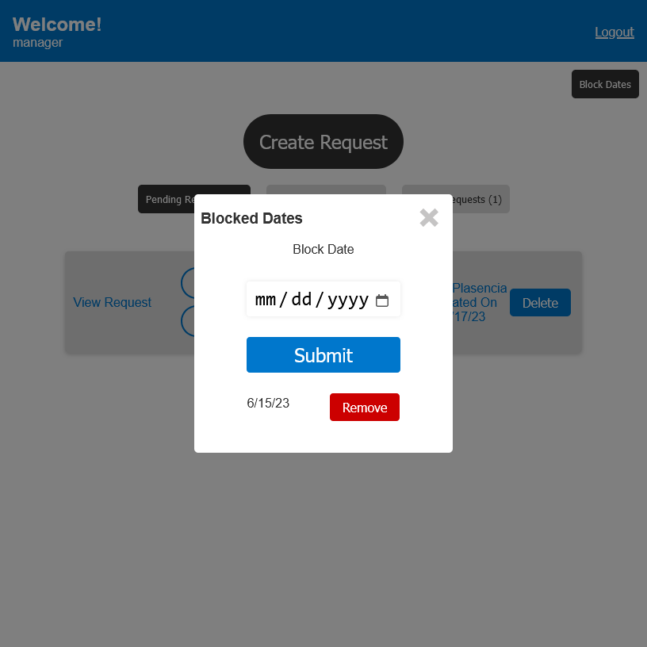

McDonald's Request Time Off App
=========================

This web application allows crew members to request days off and managers to approve or deny those requests. Managers can also block dates in advance to prevent crew members from request unavailable days off.

Technologies Used
-----------------

-   Front-end: React, Apollo Client, React Router, Bootstrap
-   Back-end: Node.js, Express.js, Apollo Server, GraphQL, MongoDB
-   Authentication: JSON Web Tokens (JWT)
-   Deployment: Heroku

Features
--------

-   Crew members can create and submit time off requests, view their own requests, and cancel requests before they are approved.
-   Managers can view all time off requests, approve or deny requests, and block dates in advance.
-   Authentication is required for all actions. Crew members and managers have different levels of access to the app.

<!--  -->

